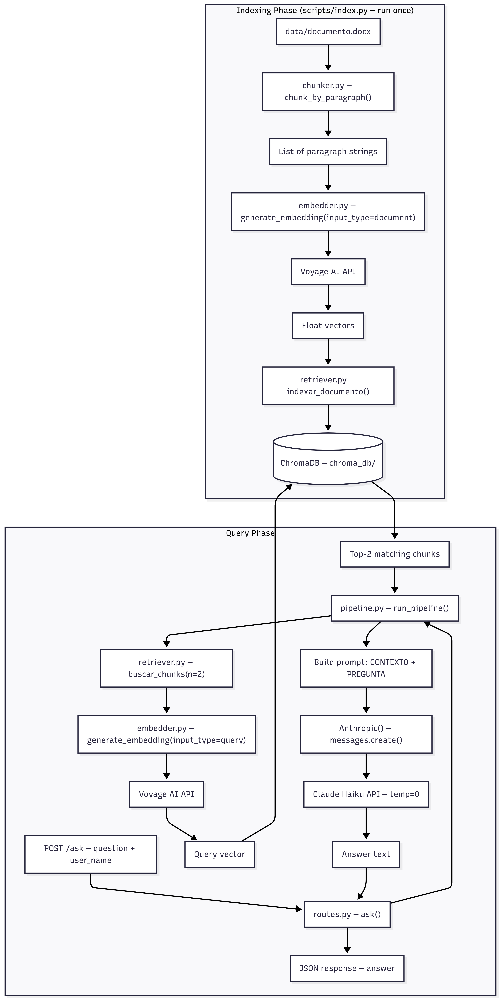

# RAG Challenge

Una API de Generación Aumentada por Recuperación (RAG) que responde preguntas sobre un documento `.docx`. Construida con Flask, ChromaDB, embeddings de Voyage AI y Anthropic Claude.

## Cómo funciona

**Indexación** (ejecutar una vez antes de servir):
1. `chunker.py` divide `data/documento.docx` en fragmentos a nivel de párrafo
2. `embedder.py` genera vectores con Voyage AI (`voyage-3-large`)
3. `retriever.py` almacena los fragmentos y vectores en una colección local de ChromaDB

**Consulta** (en cada `POST /ask`):
1. La pregunta se embebe con Voyage AI (`input_type="query"`)
2. Los 2 fragmentos más similares se recuperan de ChromaDB
3. Claude Haiku (`claude-haiku-4-5`) responde usando únicamente esos fragmentos como contexto

## Arquitectura 



## Stack tecnológico

| Componente    | Tecnología                  |
|---------------|-----------------------------|
| LLM           | Anthropic Claude Haiku 4.5  |
| Embeddings    | Voyage AI `voyage-3-large`  |
| Vector store  | ChromaDB (persistencia local)|
| Parseo de docs| python-docx                 |
| API           | Flask                       |

## Requisitos previos

- Python 3.12+
- Un archivo `.env` en este directorio con:

```
ANTHROPIC_API_KEY=your_anthropic_key
VOYAGE_API_KEY=your_voyage_key
```

## Ejecución local

```bash
# Instalar dependencias
pip install -r requirements.txt

# Indexar el documento (requerido antes de la primera ejecución)
python scripts/index.py

# Iniciar el servidor (puerto 5000)
python run.py
```

## Ejecución con Docker

> **Nota:** El archivo `.env` debe estar presente antes de construir la imagen — se utiliza durante el build para ejecutar `scripts/index.py`.  
> No publiques la imagen resultante en un registro público; los secrets quedan incorporados en la capa de build.

```bash
# Construir (indexa el documento en tiempo de build)
docker build -t rag-challenge .

# Ejecutar
docker run --env-file .env -v $(pwd)/chroma_db:/app/chroma_db -p 5000:5000 rag-challenge
```

El flag `-v` monta `chroma_db/` desde el host para que los datos indexados persistan entre reinicios del contenedor.

## API

### `POST /ask`

Request:
```json
{
  "question": "Quien es Zara?",
  "user_name": "Facu"
}
```

Response:
```json
{
  "answer": "The story is about ... 📖"
}
```

**Comportamiento:**
- Las respuestas son determinísticas (`temperature=0`)
- Responde en el mismo idioma que la pregunta
- Las respuestas se limitan a una oración y están escritas en tercera persona
- Solo se utiliza información presente en el documento; no se usa conocimiento externo


## Estructura del proyecto

```
rag-challenge/
├── run.py                  # Punto de entrada de Flask
├── requirements.txt
├── Dockerfile
├── data/
│   └── documento.docx      # Documento fuente
├── chroma_db/              # Vector store persistido (generado al indexar)
├── scripts/
│   └── index.py            # Script de indexación de una sola vez
└── app/
    ├── config.py           # Nombres de modelos, rutas, nombre de colección
    ├── api/
    │   └── routes.py       # Endpoint POST /ask
    └── rag/
        ├── chunker.py      # Divisor de párrafos
        ├── embedder.py     # Wrapper de Voyage AI
        ├── retriever.py    # Lectura/escritura en ChromaDB
        └── pipeline.py     # Orquesta la recuperación y la llamada al LLM
```
